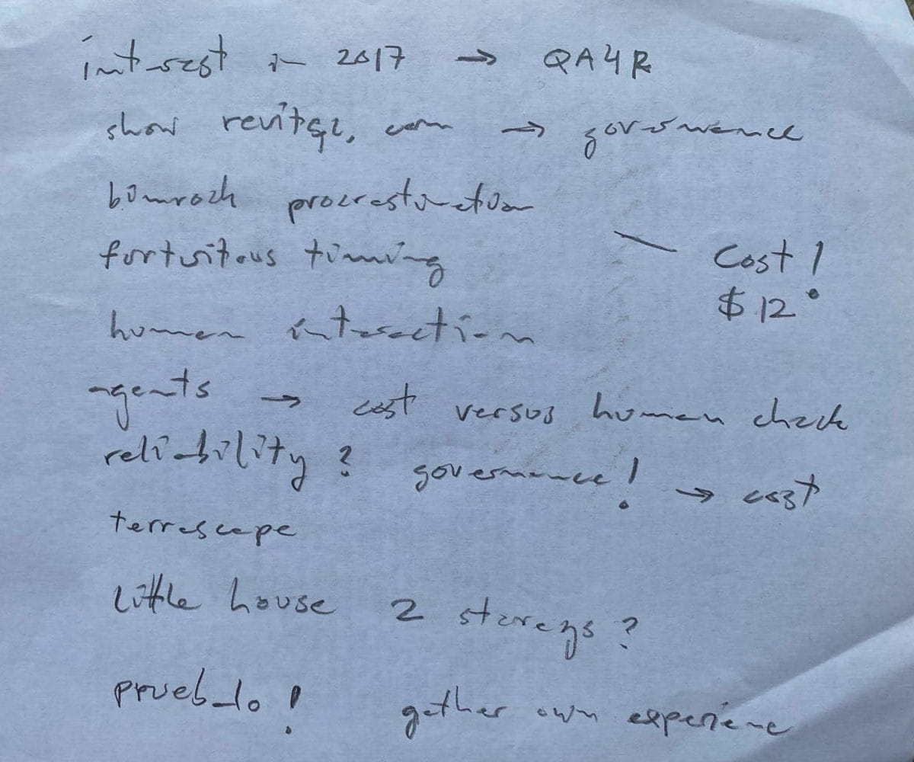
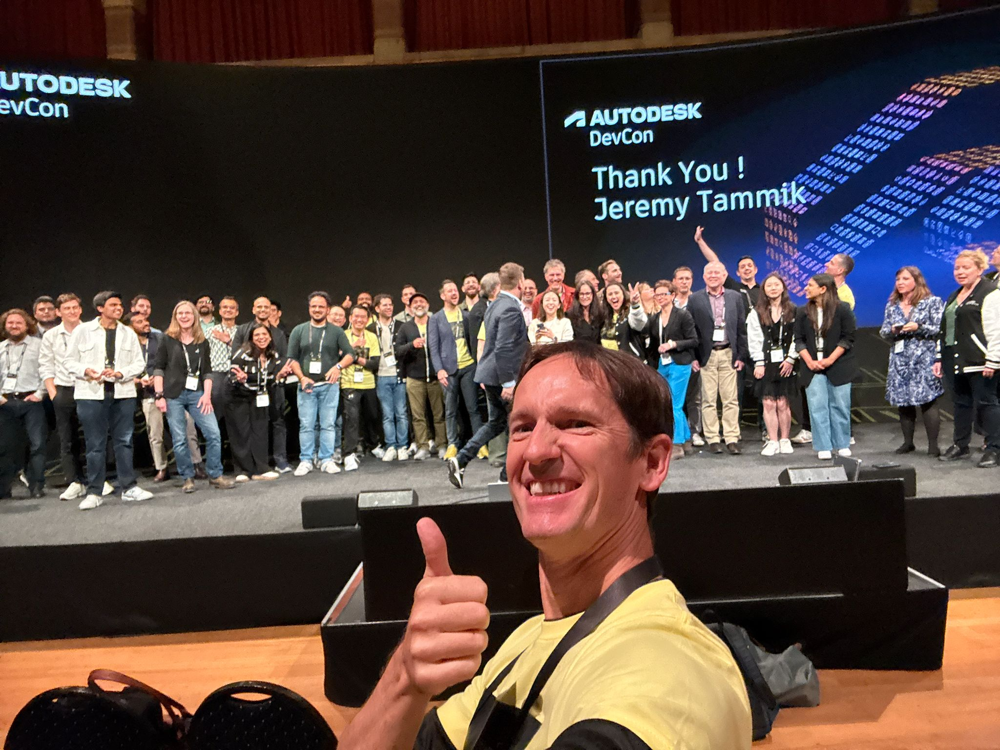

# AI and BIM Programming at EUBIM 2026 Valencia

Experiments in BIM Programming with AI.

Presented at [EUBIM.code()](https://www.eubim.com/eubim-code/), Spanish BIM programmers reunion, 
associated with the [EUBIM 2026](https://www.eubim.com/) conference in Valencia, Spain, 
at Universitat Politècnica de València, organised by Eubim, Encuentro de Usuarios BIM España.

## ¿El fin del programador de Revit? <br/>Crónica de experimentos en codificación autónoma 

Sinopsis: En esta sesión de 90 minutos, Jeremy Tammik narra su transición de programador a orquestador de IA. La crónica comienza en febrero de 2026, tras desarrollar un add-in complejo de MEP sin escribir una sola línea de código personalmente. El núcleo de la charla explora experimentos con frameworks de codificación autónoma y unit testing que utilizan agentes de IA para generar, testear y corregir código en tiempo real. Analizaremos cómo la instrumentación adaptativa permite a la IA observar el entorno transaccional de Revit, convirtiendo un ecosistema cerrado en una plataforma de desarrollo autodidacta y determinista.

## Rough Agenda Draft

- interest in 2017 --> Q4R4
- show revitqc.com --> governance
- bimrock procrastination --> cost $12
- fortuitous timing
- human interaction
- agents --> cost of AI versus cost of human intervention
- reliability? governance! --> cost
- terrascape
- little house: create with 2 storeys?
- pruebalo! gather own experience



## Agenda

1. Autodesk and The Building Coder
2. Q4R4 and the Revit API discussion forum
3. Retirement
4. HVAC MEP system generation with Claude Opus 4.6
5. Terrascape
6. Autonomous Agentic Loop for Revit API
7. Today
8. Tomorrow

## 1. Autodesk and The Building Coder

- 2005 Autodesk
- 2008 The Building Coder
- 2010 Revit API discussion forum

Employed as technology evangelist, conferences, Autodesk developer support, cf. details in bio.

## 2. Q4R4 and the Revit API discussion forum

Repetitive questions, thoughts on automation, Google translate getting better, but natural language comprehension still tricky.

- [Intelligent flexible search engine](https://chatgpt.com/share/6a0c47c8-7524-838a-a9ae-cf8ed8bde376), versus
- Machine learning, versus
- Deep learning

The implementation was out of scope for me in my daytime job, still dedicated to providing support and answering the questions that came up; I still thought about it quite a lot and published some articles on the subject of Q4R4, <i>Question Answering for Revit API</i>:

- <a href="https://jeremytammik.github.io/tbc/a/1536_q4r4.html">1536 &ndash;  The Revit API Question Answering system Q4R4</a>
- <a href="https://jeremytammik.github.io/tbc/a/1539_q4r4_lookup.html">1539 &ndash;  Q4R4 question sources, GitHub repo, <code>tbcimport.py</code> script, result presentation</a>
- <a href="https://jeremytammik.github.io/tbc/a/1688_that_bim_girl.html#3">1688 &ndash;  Notes to Self on AskNow for Q4R4</a>
- <a href="https://jeremytammik.github.io/tbc/a/2047_aps_accel_vacat.html#3">2047 &ndash;  Q4R4 Chunking with Claude, using LLM and RAG</a>
- <a href="https://jeremytammik.github.io/tbc/a/2060_modeless_tutor.html#4">2060 &ndash;  ChatGPT for Q4R4</a>

## 3. Retirement

Retired in June 2025. 

Last event: DevCon Amsterdam 2025, thank you and bye bye!



<br/>

## 4. MEP HVAC system generation, Claude Opus 4.6

I was tasked with implementing an add-in for MEP HVAC system generation from external data, e.g., a JSON file.

I addressed this after month-long procrastination, starting in the beginning of February 2026.
This was very fortuitous timing, because Claude Opus 4.6 was released just days before.
I used it via GitHub Copilot.
I spent 3-4 days in a manually driven loop.
Claude did all the coding, but I had to manually compile, launch Revit, manage the BIM, simplify, define sub-tasks and verify improvements.
AI usage details:

```
  58 + 161 + 74 = 293 requests
```

- [Usage](img/2026-02-07_gh_copilot_usage.png)
- [Breakdown](img/2026-02-07_gh_usage_breakdown.png)
- [Metered](img/2026-02-07_gh_usage_metered.png)

After a few days, I had exhausted my free February credit &ndash; just when I had completed the task.

Based on that experience, two consequences:

- Maybe I never need to touch code again
- I need to be more careful how many hours I spend coding (back pain)

I was surprised to discover:

- That I had access to such a powerful model
- Where the access was coming from
- How the access was monitored
- That the access was limited

Demo:

- MEP HVAC system export to JSON
- MEP HVAC system import from JSON

## 5. Terrascape

This does not fit into the timeline, because it extends both further back and forward.
I am a technical advisor on Revit API for [Terrascape](https://terrascape.ai).
We have implemented the [Sentinel QC](https://www.revitqc.com/) application. 
It automates QA/QC controls and implements governed write access to Revit with preview, atomic rollback, and audit receipts on every change. 
No AI touches the model. 
Deterministic tools do the work.

- [Sentinel summary](doc/2026-05-19_sentinel.md)

Core challenges addressed:

1. *Must* satisfy to 100% the top AEC modelling priority: reliablility, governance, liability, trust
2. Addresses core problem: many AEC standards are written for humans...

Example:

- Meeting Adam at [DevCon](https://aps.autodesk.com/blog/autodesk-devcon-2026-highlights)
- Email introduction to Christian, leading to LinkedIn contact
- Analysis of publicly available QLH AEC BIM requirements
- Demo implementation sprint
- Demo meeting successful
- Email with detailed requirements Friday
- Draft solution implemented and ready for next demo by Sunday

Exciting project, lots of fun, learning a lot, happy to be doing this.

## 6. Autonomous Agentic Loop for Revit API

- 2026-04-25 how to set up revit unit testing and an autonomous agentic loop copilot
- 2026-04-30 how to set up an autonomous agentic loop codex
- 2026-05-03 experiments with codex
- 2026-05-06 experiments with codex
- 2026-05-15 experiments with codex
- 2026-05-16 experiments with codex
- 2026-05-19 documentation

See the slide deck below...

## 7. Today

I prepared the documentation and slides for this EUBIM demo using GitHub Copilot and Haiku 4.5 (not the newest!) to read this repo to generate a chronological outline and a slide deck for my EUBIM workshop.

- [My prompt and LLM session notes](/doc/2026-05-19_copilot.txt)
- [Chronological outline](/doc/2026-05-19_autonomous_revit_addins_chronology.md)
- [Slide deck](https://htmlpreview.github.io/?https://github.com/jeremytammik/eubim/blob/main/doc/2026-05-19_eubim_workshop_slides.html)
  &ndash; [HTML source](/doc/2026-05-19_eubim_workshop_slides.html)

Later, I also asked for a Spanish script to ensure that I have the vocabulary at hand:

- [Prompt and response](doc/2026-05-19_script_prompt.md)
- [Spanish script](doc/2026-05-20_presentacion_script_es.md)

I skimmed the script and do not agree with it in all points, but it is fun to look at  :-)

Finally, to announce my participation on LinkedIn:

- [Prompt and response](doc/2026-05-20_linkedin_prompt.md)
- [LinkedIn article](doc/2026-05-20_linkedin_article.md)

## 8. Tomorrow

... is up to you and your agents...

What I have tested and used:

- GitHub Copilot
- Codex

Colleagues recommended looking at:

- Cline
- Cursor

Larger more powerful autonomous agent frameworks:

- Hermes
- OpenClaw

Current research emphasisis:

- Harness

Up to you:

- What are you doing?
- What are your thoughts?
- What are your plans?

<p style="font-size: larger">¡Pruebalo!</p>

P.S. I recommend reading [AINews by smol.ai](https://news.smol.ai/).
I do so daily.

P.P.S. [Google I/O 2026 keynote in 35 minutes](https://youtu.be/OMhKgQmeMhI)
shows where industry is headed today: harnesses, agents, 
24/7 background activity with voice control, 
all different kinds of input channels and remote control.

## Author

[Jeremy Tammik](https://www.linkedin.com/in/jeremytammik/),
[The Building Coder](https://jeremytammik.github.io/tbc/a/),
[@jeremytammik](https://github.com/jeremytammik)

## License

This sample is licensed under the terms of the [MIT License](http://opensource.org/licenses/MIT).
Please see the [LICENSE](LICENSE) file for full details.
